# MTGS — Workflow Diagrams

> Visual reference for every major flow in the MCP Tool Governance System.
> All diagrams are rendered as [Mermaid](https://mermaid.js.org/) — viewable in GitHub,
> GitLab, Notion, VS Code (Mermaid Preview extension), and the MkDocs site.

---

## 1. System Architecture — Component Overview

High-level map of every layer: clients → API → core engine → data stores.

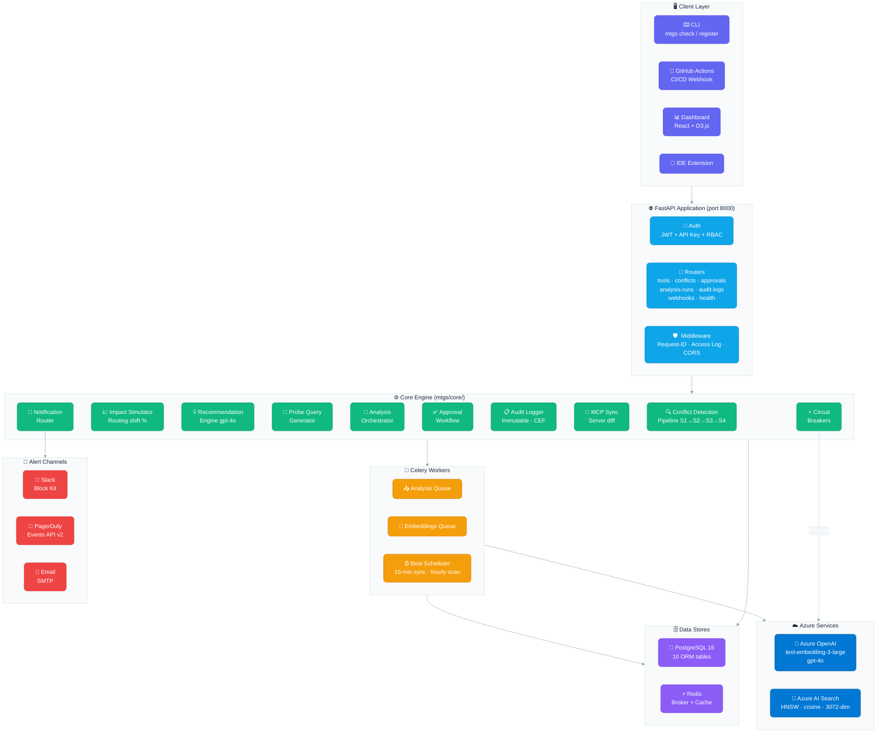

---

## 2. Tool Registration & Full Analysis Pipeline

End-to-end journey from a `POST /tools` request through all 4 detection stages,
simulation, recommendations, approval, and notification.

```mermaid
%%{init: {"theme": "base", "themeVariables": {"primaryColor": "#6366f1", "lineColor": "#94a3b8", "edgeLabelBackground": "#f1f5f9"}}}%%
flowchart TD
    classDef start     fill:#6366f1,stroke:#4f46e5,color:#fff,font-weight:bold
    classDef stage1    fill:#3b82f6,stroke:#2563eb,color:#fff
    classDef stage2    fill:#0ea5e9,stroke:#0284c7,color:#fff
    classDef stage3    fill:#10b981,stroke:#059669,color:#fff
    classDef stage4    fill:#8b5cf6,stroke:#7c3aed,color:#fff
    classDef decision  fill:#f59e0b,stroke:#d97706,color:#fff,shape:diamond
    classDef critical  fill:#ef4444,stroke:#dc2626,color:#fff,font-weight:bold
    classDef high      fill:#f97316,stroke:#ea580c,color:#fff
    classDef ok        fill:#22c55e,stroke:#16a34a,color:#fff,font-weight:bold
    classDef phase2    fill:#a855f7,stroke:#9333ea,color:#fff
    classDef action    fill:#64748b,stroke:#475569,color:#fff
    classDef notify    fill:#ec4899,stroke:#db2777,color:#fff

    REG(["🚀 Tool Registration\nPOST /v1/environments/:id/tools"])

    subgraph S1["🔵  Stage 1 · Lexical  &lt;1ms"]
        L1["Exact name match?"]
        L2["Levenshtein distance ≤ 2?"]
        L3["Jaccard token similarity ≥ 0.5?"]
    end

    subgraph S2["🔷  Stage 2 · Schema  &lt;1ms"]
        SC1["Type collision?\nsame param, different JSON type"]
        SC2["Required-field overlap ≥ 70%?"]
    end

    subgraph S3["🟢  Stage 3 · Semantic  ~50ms"]
        EM["Generate embedding\ntext-embedding-3-large"]
        ANN["ANN search\nAzure AI Search HNSW"]
        COS["Cosine similarity ≥ 0.80?"]
    end

    subgraph S4["🟣  Stage 4 · Behavioral  2–5s"]
        PQ["Generate probe queries\nProbeQueryGenerator"]
        BL["Baseline routing\nLLM picks tool — N trials"]
        CD["Candidate routing\nLLM picks from registry+candidate"]
        SH["Compute routing_shift_pct"]
    end

    subgraph REC_PHASE["💡  Recommendation Engine"]
        RB["Build conflict prompt"]
        GP["gpt-4o generates\nup to 3 recommendations\nRENAME · REWRITE · NARROW\nSCHEMA · DEPRECATE"]
    end

    PERSIST["💾 Persist conflicts\n+ analysis run to DB"]
    RISK["📊 Compute risk score\n0–100"]

    SEV_CHECK{"⚠️ Severity ≥ HIGH?"}

    APPR["✅ Create ApprovalRequest\nstatus: PENDING"]
    ACTIVE["🟢 Tool set ACTIVE"]

    NOT["🔔 NotificationRouter\nSlack · PagerDuty · Email"]
    AUD_ENT["📋 Write AuditEntry\nIMMUTABLE"]
    CI_PASS(["✅ CI Gate PASS\nHTTP 200"])
    CI_FAIL(["🚫 CI Gate FAIL\nHTTP 409 + recommendations"])

    REG --> S1
    L1 -->|"✅ exact match"| CRIT["🔴 CRITICAL\nEXACT_NAME"]
    L1 -->|"❌ no match"| L2
    L2 -->|"✅ close match"| MED["🟡 MEDIUM\nSIMILAR_NAME"]
    L2 -->|"❌"| L3
    L3 -->|"✅ overlap"| MED
    L3 -->|"❌ clean"| S2

    CRIT -->|"short-circuit\nskip S2–S4"| PERSIST
    MED --> S2

    SC1 -->|"✅ collision"| HIGH1["🟠 HIGH\nTYPE_COLLISION"]
    SC1 -->|"❌"| SC2
    SC2 -->|"✅ overlap"| HIGH1
    SC2 -->|"❌ clean"| S3

    HIGH1 --> PERSIST
    EM --> ANN --> COS
    COS -->|"✅ similar"| SEMOV["🟠 HIGH\nSEMANTIC_OVERLAP"]
    COS -->|"❌ distinct"| S4

    SEMOV --> S4
    PQ --> BL --> CD --> SH

    SH --> REC_PHASE
    RB --> GP

    GP --> PERSIST
    PERSIST --> RISK --> SEV_CHECK

    SEV_CHECK -->|"YES\nCRITICAL/HIGH"| APPR
    SEV_CHECK -->|"NO\nMEDIUM/LOW"| ACTIVE

    APPR --> NOT
    NOT --> AUD_ENT

    ACTIVE --> AUD_ENT
    AUD_ENT --> CI_PASS

    CRIT --> CI_FAIL
    HIGH1 --> CI_FAIL

    class REG start
    class L1,L2,L3 stage1
    class SC1,SC2 stage2
    class EM,ANN,COS stage3
    class PQ,BL,CD,SH stage4
    class RB,GP phase2
    class CRIT,CI_FAIL critical
    class HIGH1,SEMOV,APPR,NOT high
    class ACTIVE,CI_PASS ok
    class PERSIST,RISK,AUD_ENT action
```

---

## 3. Conflict Detection Pipeline — Stage Detail

A closer look at what each stage checks and how severity is assigned.

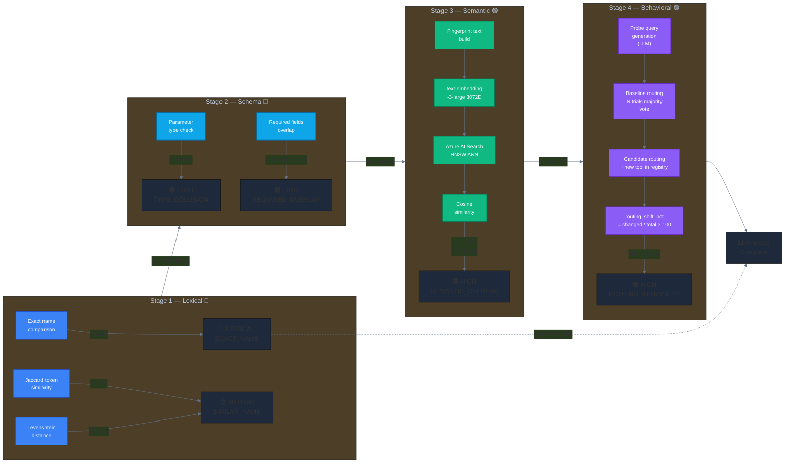

---

## 4. Impact Simulation — Routing Shift Measurement

How MTGS quantifies the blast radius of adding a new tool.

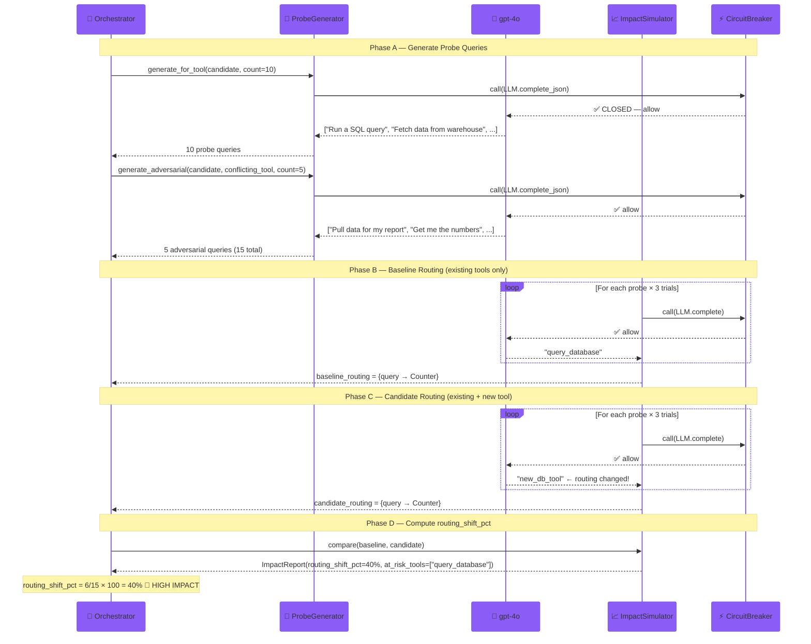

---

## 5. Approval Workflow — State Machine

How CRITICAL/HIGH conflicts are gated through human review.

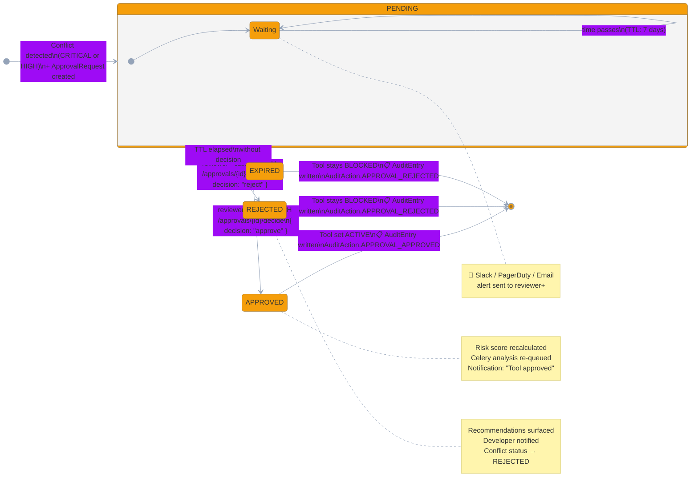

---

## 6. RBAC — Role Hierarchy & Permissions

Who can do what across every API surface.

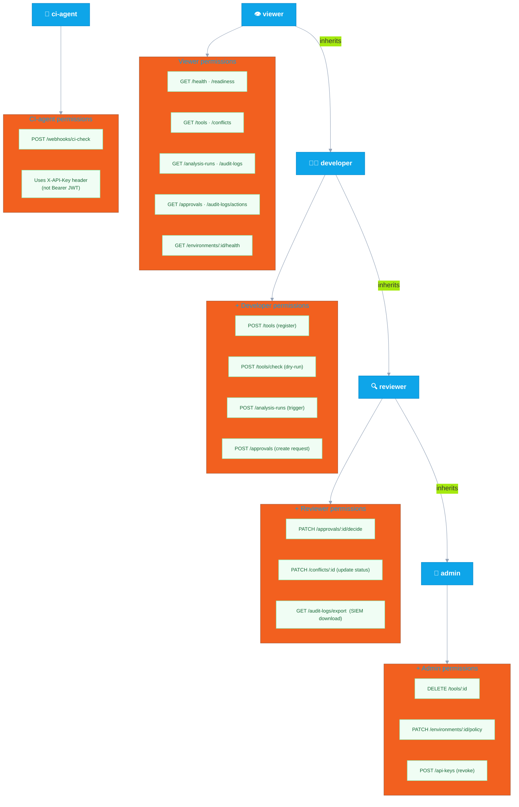

---

## 7. Audit Log & SIEM Export Flow

How every governance action becomes an immutable, SIEM-ready audit entry.

```mermaid
%%{init: {"theme": "base", "themeVariables": {"primaryColor": "#64748b", "lineColor": "#94a3b8"}}}%%
flowchart LR
    classDef event   fill:#6366f1,stroke:#4f46e5,color:#fff
    classDef logger  fill:#0ea5e9,stroke:#0284c7,color:#fff
    classDef entry   fill:#10b981,stroke:#059669,color:#fff
    classDef export  fill:#f59e0b,stroke:#d97706,color:#fff
    classDef siem    fill:#ec4899,stroke:#db2777,color:#fff

    subgraph EVENTS["🔵  Governance Events (13 types)"]
        E1["TOOL_REGISTERED"]
        E2["CONFLICT_DETECTED"]
        E3["APPROVAL_APPROVED"]
        E4["APPROVAL_REJECTED"]
        E5["ANALYSIS_RUN_COMPLETED"]
        E6["API_KEY_CREATED"]
        E7["... 7 more"]
    end

    AUD["🔐  AuditLogger\nawait logger.record(action, actor_id,\n  resource_id, resource_type,\n  environment_id, metadata)"]

    ENTRY["📋  AuditEntry\nfrozen=True 🔒\nentry_id · action · actor_id\nresource_id · timestamp\nmetadata: dict"]

    DB["🐘  PostgreSQL\nappend-only table"]

    subgraph API_LAYER["📡  GET /v1/api/audit-logs/"]
        FILT["Filter by:\naction · actor · resource\nenvironment · date range"]
        PAGE["Paginate\n(newest-first)"]
    end

    subgraph EXPORT["📤  GET /audit-logs/export  (reviewer+)"]
        JSON["format=json\n→ list[dict]\nContent-Disposition: attachment"]
        CEF["format=cef\n→ CEF string per line\n\nCEF:0|MTGS|MCPToolGovernance|1.0\n|CONFLICT_DETECTED|...|8|..."]
    end

    subgraph SIEM_TARGETS["🚨  SIEM Platforms"]
        SP["Splunk"]
        MS["Microsoft Sentinel"]
        QR["IBM QRadar"]
        EL["Elastic SIEM"]
    end

    EVENTS --> AUD
    AUD --> ENTRY
    ENTRY --> DB
    DB --> API_LAYER
    API_LAYER --> FILT --> PAGE
    PAGE --> EXPORT
    EXPORT --> JSON
    EXPORT --> CEF
    CEF --> SIEM_TARGETS

    class E1,E2,E3,E4,E5,E6,E7 event
    class AUD logger
    class ENTRY,DB entry
    class JSON,CEF export
    class SP,MS,QR,EL siem
```

---

## 8. Circuit Breaker — State Machine

How MTGS protects itself when Azure OpenAI, Azure AI Search, or webhooks degrade.

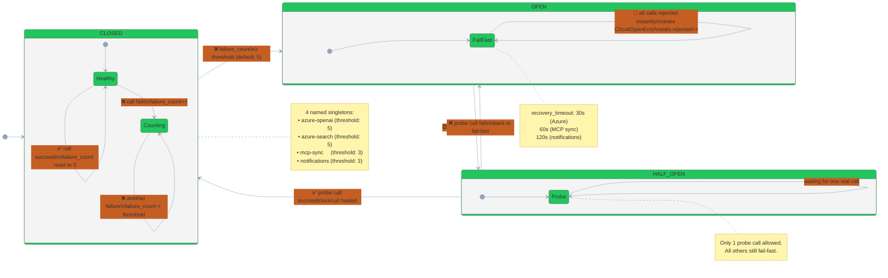

---

## 9. CI/CD Integration Flow

How MTGS acts as a governance gate inside GitHub Actions (or any CI pipeline).

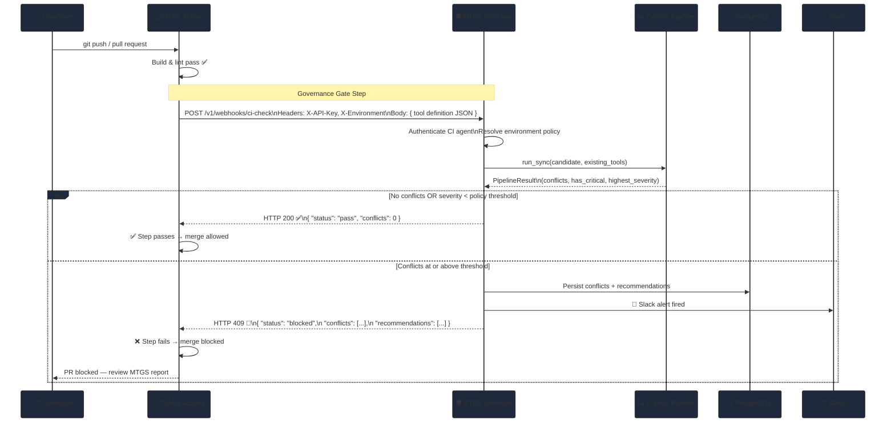

---

## 10. MCP Server Sync — Periodic Drift Detection

How Celery beat keeps the database in sync with live MCP servers.

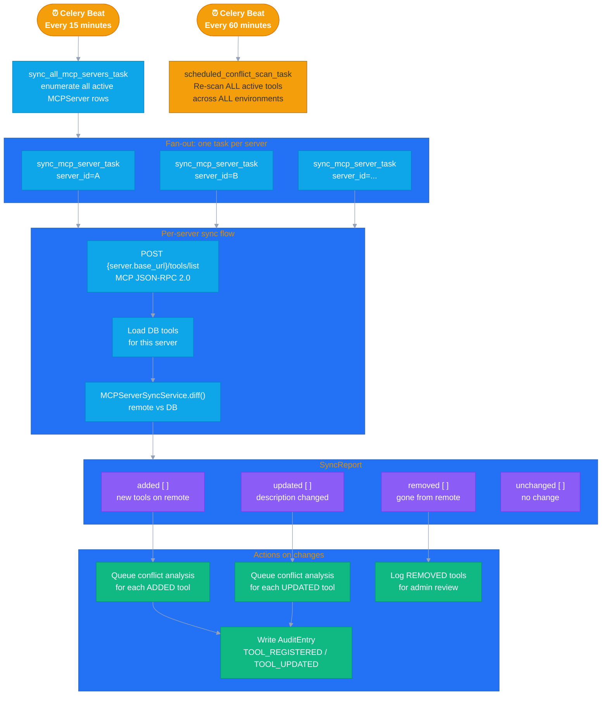

---

## 11. Recommendation Engine — From Conflict to Fix

How gpt-4o turns a conflict report into actionable tool improvements.

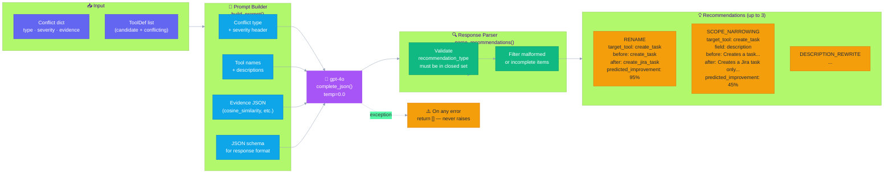

---

> **Tip:** Install the [Mermaid Preview](https://marketplace.visualstudio.com/items?itemName=bierner.markdown-mermaid)
> VS Code extension to render all diagrams inline while editing this file.
